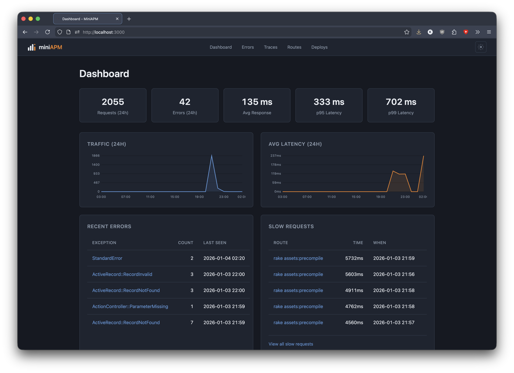

# MiniAPM

The smallest useful APM. A self-hosted application performance monitor and error tracker built on OpenTelemetry.



## Features

- **Distributed Tracing** - Full request-to-response visibility with waterfall visualization
- **Error Tracking** - Exceptions with stack traces and source context, auto-grouped by fingerprint
- **Route Performance** - P50, P95, P99 latencies with request counts and error rates
- **N+1 Query Detection** - Automatically identifies repeated query patterns
- **Deploy Tracking** - Correlate releases with performance changes

## Architecture

MiniAPM consists of two services:

| Service | Port | Description |
|---------|------|-------------|
| `miniapm` | 3000 | **Collector** - Ingestion API for traces, errors, deploys |
| `miniapm-admin` | 3001 | **Dashboard** - Web UI for viewing and managing data |

Both services share the same SQLite database.

## Quick Start

### Docker Compose (recommended)

```yaml
services:
  miniapm:
    image: ghcr.io/miniapm/miniapm
    command: miniapm
    ports:
      - "3000:3000"
    volumes:
      - miniapm_data:/data
    environment:
      - RUST_LOG=mini_apm=info

  miniapm-admin:
    image: ghcr.io/miniapm/miniapm
    command: miniapm-admin
    ports:
      - "3001:3001"
    volumes:
      - miniapm_data:/data
    environment:
      - RUST_LOG=mini_apm_admin=info
      - ENABLE_USER_ACCOUNTS=true
      - SESSION_SECRET=change-me-to-random-string
    depends_on:
      - miniapm

volumes:
  miniapm_data:
```

```bash
docker compose up -d
```

- Collector API: http://localhost:3000
- Dashboard: http://localhost:3001

On first run, check collector logs for API key:
```
INFO mini_apm::server: Single-project mode - API key: proj_abc123...
```

### From Source

```bash
git clone https://github.com/miniapm/miniapm
cd miniapm

# Run collector
cargo run -p mini-apm

# Run admin dashboard (in another terminal)
cargo run -p mini-apm-admin
```

## Sending Data

### Rails with miniapm gem (recommended)

Add to your Gemfile:
```ruby
gem 'miniapm'
```

Configure in `config/initializers/miniapm.rb`:
```ruby
MiniAPM.configure do |config|
  config.endpoint = "http://localhost:3000"
  config.api_key = "proj_abc123..."
  config.service_name = "my-app"
end
```

### Any OpenTelemetry SDK

Configure your OTLP exporter:
```bash
OTEL_EXPORTER_OTLP_ENDPOINT=http://localhost:3000/ingest
OTEL_EXPORTER_OTLP_HEADERS=Authorization=Bearer proj_abc123...
```

### Error Tracking API

```bash
curl -X POST http://localhost:3000/ingest/errors \
  -H "Authorization: Bearer proj_abc123..." \
  -H "Content-Type: application/json" \
  -d '{
    "exception_class": "RuntimeError",
    "message": "Something went wrong",
    "backtrace": ["app/models/user.rb:42:in `validate'"],
    "context": {"user_id": 123}
  }'
```

### Deploy Tracking API

```bash
curl -X POST http://localhost:3000/ingest/deploys \
  -H "Authorization: Bearer proj_abc123..." \
  -H "Content-Type: application/json" \
  -d '{
    "version": "v1.2.3",
    "git_sha": "abc123",
    "deployer": "ci"
  }'
```

## Configuration

### Collector (`miniapm`)

| Variable | Default | Description |
|----------|---------|-------------|
| `SQLITE_PATH` | `./data/miniapm.db` | Database file location |
| `RUST_LOG` | `mini_apm=info` | Log level |
| `RETENTION_DAYS_ERRORS` | `30` | Days to keep error data |
| `RETENTION_DAYS_SPANS` | `7` | Days to keep trace spans |
| `RETENTION_DAYS_HOURLY_ROLLUPS` | `90` | Days to keep hourly aggregates |
| `SLOW_REQUEST_THRESHOLD_MS` | `500` | Threshold for slow request alerts |
| `ENABLE_PROJECTS` | `false` | Enable multi-project mode |

### Dashboard (`miniapm-admin`)

| Variable | Default | Description |
|----------|---------|-------------|
| `SQLITE_PATH` | `./data/miniapm.db` | Database file location (same as collector) |
| `ENABLE_USER_ACCOUNTS` | `false` | Enable multi-user authentication |
| `SESSION_SECRET` | (required) | Secret for session cookies |
| `MINI_APM_URL` | `http://localhost:3001` | URL for generating links |

## Multi-User Mode

To enable login and user management on the dashboard:

```bash
export SESSION_SECRET=$(openssl rand -hex 32)
export ENABLE_USER_ACCOUNTS=true
```

Default admin credentials on first run:
- Username: `admin`
- Password: `admin` (you'll be prompted to change it)

## CLI Commands

```bash
# Collector server
miniapm                         # Start collector (default port 3000)
miniapm -p 8080                 # Start on custom port

# Admin dashboard
miniapm-admin                   # Start dashboard (default port 3001)

# CLI tools
miniapm-cli create-key <name>   # Create a new API key
miniapm-cli list-keys           # List all API keys
```

## Health Checks

Both services expose health endpoints:

```bash
# Collector
curl http://localhost:3000/health

# Dashboard
curl http://localhost:3001/health
```

## Development

```bash
# Run tests
cargo test --workspace

# Run collector
cargo run -p mini-apm

# Run dashboard
cargo run -p mini-apm-admin

# Run CLI
cargo run -p mini-apm-cli -- create-key mykey

# Check formatting
cargo fmt --all --check

# Run clippy
cargo clippy --workspace
```

## Tech Stack

- **Rust** with [Rama](https://github.com/plabayo/rama) web framework
- **SQLite** - Zero-config, automatic migrations
- **OTLP/HTTP** - Standard OpenTelemetry protocol

## License

MIT License - see [LICENSE](LICENSE) for details.
